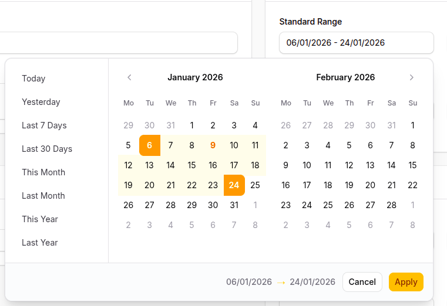
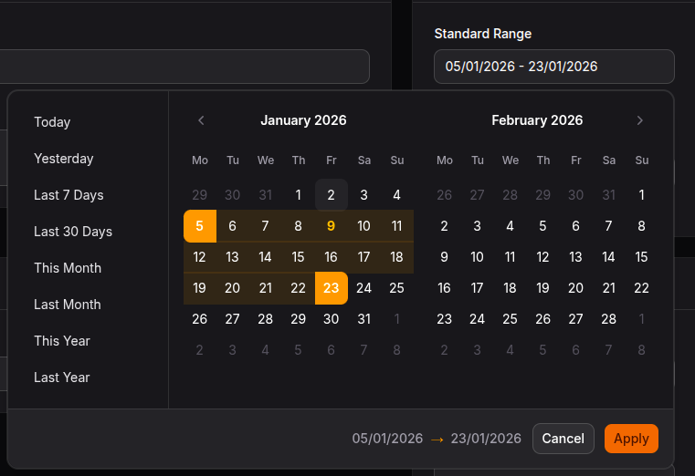

# Filament Date Range Picker and Filter

[](https://packagist.org/packages/malzariey/filament-daterangepicker-filter)
[](https://packagist.org/packages/malzariey/filament-daterangepicker-filter)

A native Alpine.js date range picker for [Filament](https://filamentphp.com/). Select date ranges, months, or years with support for presets, time selection, and full modal/slide-over compatibility.

## Features

- 🗓️ **Day, Month, or Year Picker** - Choose the granularity that fits your needs
- ⌨️ **Keyboard Input Support** - Type dates directly with format validation
- 🎯 **Modal Compatible** - Dropdown teleports to body, solving z-index issues
- 🕐 **Time Picker** - Optional time selection with 12/24 hour format
- 🌍 **Localization** - Full i18n support via Day.js locales
- ♿ **Accessible** - Keyboard navigation and ARIA attributes
- 🎨 **Native Filament UI** - Seamlessly matches Filament v4 styling

## Installation

```bash
composer require malzariey/filament-daterangepicker-filter
```

Publish translations (optional):

```bash
php artisan vendor:publish --tag="filament-daterangepicker-filter-translations"
```

## Screenshots

#### Light mode


#### Dark mode


## Basic Usage

### As a Field
```php
use Malzariey\FilamentDaterangepickerFilter\Fields\DateRangePicker;

DateRangePicker::make('created_at'),
```

### As a Filter
```php
use Malzariey\FilamentDaterangepickerFilter\Filters\DateRangeFilter;

DateRangeFilter::make('created_at'),
```

---

## Picker Type Modes

### Day Picker (Default)
Select specific dates:

```php
DateRangePicker::make('date_range')
    ->format('d/m/Y');
```

### Month Picker
Select entire months. The popup header includes previous/next-year buttons and a compact numeric year input, so users can jump to a year without stepping one year at a time.

```php
use Malzariey\FilamentDaterangepickerFilter\Fields\DateRangePicker;

DateRangePicker::make('billing_period')
    ->monthPicker()
    ->format('F Y');
```

Month picker mode also supports typed input. Pressing Enter applies the typed month value without falling through to day-picker selection behavior:

```php
DateRangePicker::make('billing_period')
    ->monthPicker()
    ->singleCalendar()
    ->allowInput()
    ->format('m/Y');
```

Range input works with the configured separator:

```php
DateRangePicker::make('billing_period')
    ->monthPicker()
    ->allowInput()
    ->format('m/Y');
```

Example input:

```text
06/2026 - 08/2026
```

Month picker year options and disabled months respect `minYear()`, `maxYear()`, `minDate()`, and `maxDate()`:

```php
DateRangePicker::make('billing_period')
    ->monthPicker()
    ->format('m/Y')
    ->minYear(2020)
    ->maxYear(2030)
    ->minDate('2020-06-01')
    ->maxDate('2030-12-31');
```

### Year Picker
Select entire years:

```php
DateRangePicker::make('fiscal_years')
    ->yearPicker()
    ->format('Y')
    ->minYear(2020)
    ->maxYear(2030);
```

---

## New Features

### Keyboard Input
Allow users to type dates directly:

```php
DateRangePicker::make('dates')
    ->allowInput(); // Enable keyboard entry with format validation
```

When `allowInput()` is enabled, pressing Enter while focused inside the input parses and applies the typed value first. Invalid partial input does not overwrite the previous valid selection unless the user clears the field.

### Modal & Slide-Over Compatibility
The dropdown teleports to `<body>` by default to avoid z-index issues:

```php
DateRangePicker::make('dates')
    ->teleport();      // Enabled by default

DateRangePicker::make('dates')
    ->teleport(false); // Disable if needed
```

### Dual State Mode
Store start and end dates in separate Livewire properties:

```php
DateRangePicker::make('date_range')
    ->useDualState('start_date', 'end_date');

// In your Livewire component:
public ?string $start_date = null;
public ?string $end_date = null;
```

---

## Custom Events

The component dispatches custom events for integration with Livewire or JavaScript:

```javascript
// Listen for date range changes
document.addEventListener('apply.daterangepicker', (e) => {
    console.log('Start:', e.detail.startDate);
    console.log('End:', e.detail.endDate);
    console.log('Formatted:', e.detail.formattedValue);
});

// Other available events
document.addEventListener('cancel.daterangepicker', (e) => { /* ... */ });
document.addEventListener('show.daterangepicker', (e) => { /* ... */ });
document.addEventListener('hide.daterangepicker', (e) => { /* ... */ });
```

| Event | Fired When |
|-------|------------|
| `apply.daterangepicker` | User clicks Apply or autoApply triggers |
| `cancel.daterangepicker` | User clicks Cancel or presses Escape |
| `show.daterangepicker` | Picker dropdown opens |
| `hide.daterangepicker` | Picker dropdown closes |

---

## Configuration Options

### Timezone
```php
DateRangePicker::make('created_at')->timezone('UTC')
```

### Start and End Dates
```php
DateRangePicker::make('created_at')
    ->startDate(Carbon::now())
    ->endDate(Carbon::now())

// Or use shortcuts:
DateRangePicker::make('created_at')->defaultToday()
DateRangePicker::make('created_at')->defaultLast7Days()
DateRangePicker::make('created_at')->defaultThisMonth()
DateRangePicker::make('created_at')->defaultLastYear()
```

### Min and Max Dates
```php
DateRangePicker::make('created_at')
    ->minDate(Carbon::now()->subMonth())
    ->maxDate(Carbon::now()->addMonth())
```

### First Day of Week
```php
DateRangePicker::make('created_at')->firstDayOfWeek(1) // Monday
```

### Time Picker
```php
DateRangePicker::make('created_at')
    ->timePicker()
    ->timePicker24()       // Use 24-hour format
    ->timePickerSecond()   // Show seconds
    ->timePickerIncrement(30) // 30-minute increments
```

### Auto Apply
```php
DateRangePicker::make('created_at')->autoApply()
```

### Single Calendar
```php
DateRangePicker::make('created_at')->singleCalendar()
```

### Disabled Dates
```php
DateRangePicker::make('created_at')
    ->disabledDates(['2024-12-25', '2024-12-26'])
```

### Display Format

Use PHP [Carbon date format](https://www.php.net/manual/en/datetime.format.php) tokens. The JavaScript display format is auto-converted:

```php
DateRangePicker::make('created_at')
    ->format('d/m/Y')      // Renders as DD/MM/YYYY in the browser

DateRangePicker::make('created_at')
    ->format('Y-m-d')      // Renders as YYYY-MM-DD in the browser

DateRangePicker::make('created_at')
    ->format('d M Y')      // Renders as DD MMM YYYY in the browser
```

> **Note:** The deprecated `->displayFormat('DD/MM/YYYY')` method still works but is no longer recommended. Use `->format()` with PHP Carbon tokens instead — the JavaScript display format is auto-converted.

### Predefined Ranges
```php
DateRangePicker::make('created_at')
    ->ranges([
        'Today' => [now(), now()],
        'This Week' => [now()->startOfWeek(), now()->endOfWeek()],
        'Last 30 Days' => [now()->subDays(30), now()],
    ])
```

### Use Range Labels
Display preset labels instead of dates:
```php
DateRangePicker::make('created_at')->useRangeLabels()
```

### Disable Custom Range Selection
```php
DateRangePicker::make('created_at')->disableCustomRange()
```

### Drop and Open Directions
```php
use Malzariey\FilamentDaterangepickerFilter\Enums\DropDirection;
use Malzariey\FilamentDaterangepickerFilter\Enums\OpenDirection;

DateRangePicker::make('created_at')
    ->drops(DropDirection::UP)
    ->opens(OpenDirection::CENTER)
```

### Max Span
```php
DateRangePicker::make('created_at')
    ->maxSpan(['months' => 1]) // days, months, or years
```

### Week Numbers
```php
DateRangePicker::make('created_at')
    ->showWeekNumbers()     // Localized week numbers
    ->showISOWeekNumbers()  // ISO week numbers
```

### Day Picker Month/Year Dropdowns
Use `showDropdowns()` to show month and year dropdowns in the day picker header:

```php
DateRangePicker::make('created_at')
    ->showDropdowns()
    ->minYear(2000)
    ->maxYear(2030)
```

Month picker mode always shows its own numeric year input in the popup header and uses the same year/date constraints.

---

## Filter Options

### Custom Query
```php
use Malzariey\FilamentDaterangepickerFilter\Filters\DateRangeFilter;

DateRangeFilter::make('created_at')
    ->modifyQueryUsing(fn(Builder $query, ?Carbon $startDate, ?Carbon $endDate, $dateString) =>
        $query->when(!empty($dateString),
            fn(Builder $query) => $query->whereBetween('created_at', [$startDate, $endDate])
        )
    )
```

### Filter Indicator
```php
DateRangeFilter::make('created_at')->withIndicator()
```

---

## Migration from v3.x and v4.x

### Breaking Changes

1. **jQuery/Moment.js removed** - The component now uses Alpine.js and Day.js
2. **Format tokens** - Use `->format()` with PHP Carbon tokens (e.g. `d/m/Y`). The JavaScript display format is auto-converted — there is no need to specify Day.js tokens manually.

### New Methods

| Method | Description |
|--------|-------------|
| `->monthPicker()` | Select months only |
| `->yearPicker()` | Select years only |
| `->allowInput()` | Enable keyboard date entry |
| `->teleport(bool)` | Control dropdown positioning (enabled by default) |
| `->useDualState(start, end)` | Store dates in separate properties |
| `->format('d/m/Y')` | Set date format using PHP Carbon tokens (auto-converts to JS) |
| `->pickerType(PickerType)` | Set picker granularity via enum |

### Deprecated Methods

| Deprecated Method | Replacement | Since |
|---|---|---|
| `->displayFormat('DD/MM/YYYY')` | `->format('d/m/Y')` | 2.5.1 |
| `->setTimePickerOption()` | `->timePicker()` | 2.5.1 |
| `->setTimePickerIncrementOption()` | `->timePickerIncrement()` | 2.5.1 |
| `->setAutoApplyOption()` | `->autoApply()` | 2.5.1 |
| `->setLinkedCalendarsOption()` | `->linkedCalendars()` | 2.5.1 |
| `->getTimePickerIncrementOption()` | `->getTimePickerIncrement()` | 2.5.1 |
| `->getAutoApplyOption()` | `->getAutoApply()` | 2.5.1 |
| `->getLinkedCalendarsOption()` | `->getLinkedCalendars()` | 2.5.1 |
| `->getTimePickerOption()` | `->getTimePicker()` | 2.5.1 |

---

## Credits

- [Majid Al-Zariey](https://github.com/malzariey)
- [All Contributors](https://github.com/malzariey/filament-daterangepicker-filter/graphs/contributors)

## License

The MIT License (MIT). Please see [License File](https://github.com/malzariey/filament-daterangepicker-filter/blob/main/LICENSE.md) for more information.

## Acknowledgements

- Built with [Alpine.js](https://alpinejs.dev/), [Day.js](https://day.js.org/), and [Floating UI](https://floating-ui.com/)
- Special thanks to [JetBrains](https://www.jetbrains.com) for their support of open-source projects
